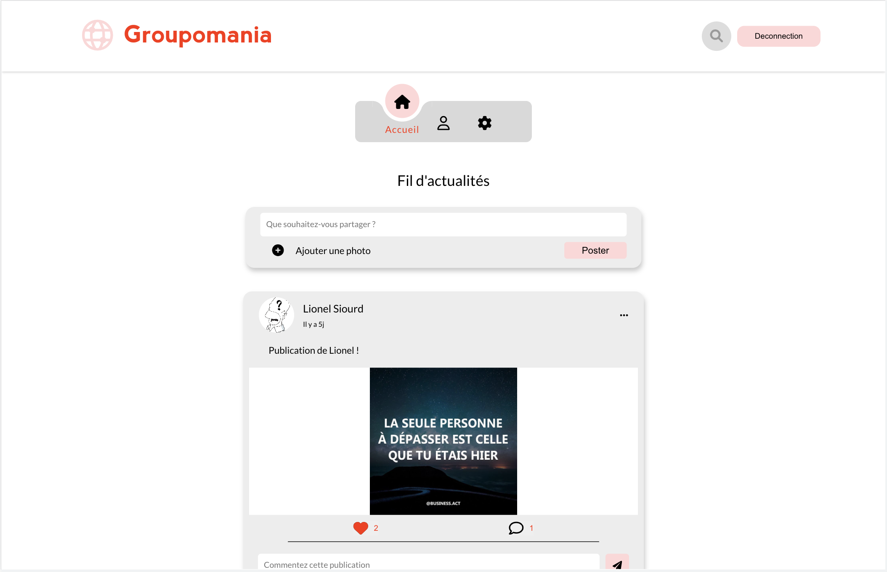

# PROJET 7 - Creez un réseau social d'entreprise

## About 
This project is an internal social network created for the compagny Groupomania. Principal aim of this website is to improve the communication and working atmosphere between the salaries of the compagny.



## Installation
To install this projet [node.js](https://nodejs.org/en/) and [git](https://git-scm.com/) are required

- Clone this projet 

```text
git clone https://github.com/sismitrii/OC_P7_Groupomania.git 
``` 

### DataBase Setup
The API is working with a MongoDB dataBase. So an MongoDB account is required. If you do not have one, it's possible to register for free at this [adress](https://www.mongodb.com/cloud/atlas/register).

Then :
- Create a new project
- Built a database
    - Choose Shared Free (on right)
    - Possible to change the name of the cluster (Default Cluster0)
    - Create Cluster
    - Username and Password :
        - Define an Username and a password (note that password)
        - Create User
    - Click on "Add My Current IP Address"
    - Finish and Close
    - In the Database Tab click on Connect > Connect your Application
    - Copy the link starting by "mongodb+srv://..."

In the floder back-end you will find a file ".env.sample"
- Dupplicate this files
- Rename it `.env``
- Open it and fill it :
    - MONGODB_CONNECT with link copied before and replace <password> by the password you note previously.

### Back-end
- Go in the back-end folder

```text
cd back-end
```

- Install dependencies : 

```text
npm install
```
Complete files .env with:
- A Secret password used for token creation: JWT_PASSWORD
- Email and password of admin account: ADMIN_EMAIL, ADMIN_PASSWORD
- Email gmail use to send email to user which have forgot their password: FORGOT_EMAIL

Moreover in order to gave the possibility to the server to send email via an gmail adress it's necessary to authorize it with a sécurity password to get this password :
- Connect on gmail account associated (FORGOT_EAMAIL)
- Click on your profil then Manage your Google Account
- In Security tab in Signing in to Google part activate 2-Step-Verification
- Still in Signing in to Google click on App passwords
- Select an application: "Other" Groupomania
- Generate, copy the password and paste it on file .env for FORGOT_PASSWORD

- Start the API:

```text
npm start
```

### Front-end
- Install dependencies: 

```text
npm install
````

- Start localy the application
```text
npm start
```

## Technical stack
#####Database:  
- MongoDb Atlas

#####Back-end:  
- Node.js
- Express

#####Front-end:   
- React.js (Create React App)
